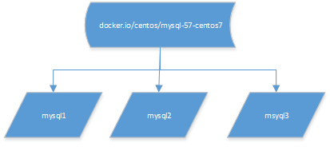
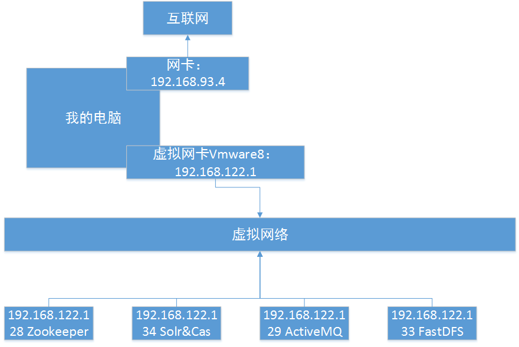
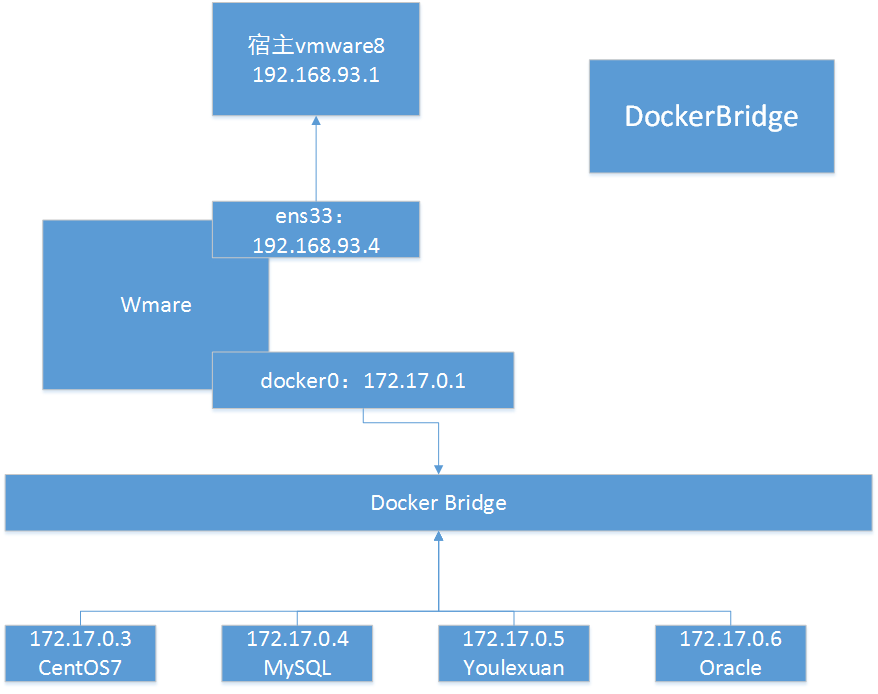
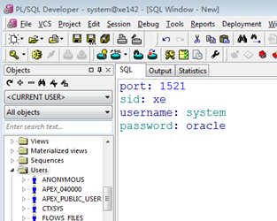
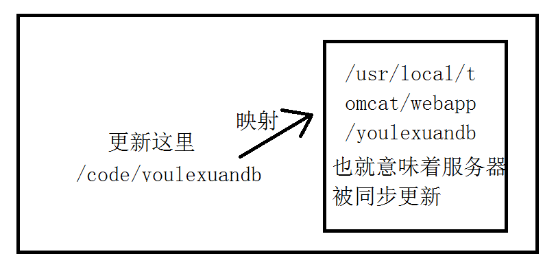

# Docker 基础

## 简介

```
Docker 是一个开源的应用容器引擎，让开发者可以打包他们的应用以及依赖包到一个可移植的容器中，然后发布到任何流行的 Linux 机器上，也可以实现虚拟化。容器是完全使用沙箱机制，相互之间不会有任何接口。
```


## docker和vm的区别

                                                  


```
VM(VMware)在宿主机器、宿主机器操作系统的基础上创建虚拟层、虚拟化的操作系统、虚拟化的仓库，然后再安装应用；
Container(Docker容器)，在宿主机器、宿主机器操作系统上创建Docker引擎，在引擎的基础上再安装应用。
那么问题来了，没有操作系统，怎么运行程序？
```

## 镜像和容器

```
镜像是模版，容器是通过模版产生的实例，类似于OOP中类和对象的关系。
```



## 网络拓扑

### 虚拟机的网络拓扑



### Docker容器的网路拓扑

```
docker bridge不是桥接模式，而是NAT模式！！！
```



## 举个例子

```
oracle安装是一个非常繁琐的事，windows下安装经常因为兼容性而失败，linux下安装甚至要修改内核，调整内存分配。那在docker下又会怎么样呢？
```


### 装载镜像

```sh
[root@container ~]# docker load<oracle-xe-11g.tar 
56abdd66ba31: Loading layer [===============================>] 196.8 MB/196.8 MB
9468150a390c: Loading layer [===============================>] 208.9 kB/208.9 kB
11083b444c90: Loading layer [===============================>] 4.608 kB/4.608 kB
5f70bf18a086: Loading layer [===============================>] 1.024 kB/1.024 kB
7ff5adb2cdd4: Loading layer [===============================>] 3.072 kB/3.072 kB
7b4c3e9800ad: Loading layer [===============================>]  2.56 kB/2.56 kB
1370abeeeb68: Loading layer [===============================>] 3.584 kB/3.584 kB
faa7a78bc2b3: Loading layer [===============================>] 3.584 kB/3.584 kB
f57380ce36b1: Loading layer [===============================>] 607.2 MB/607.2 MB
bc9218f9a990: Loading layer [===============================>] 4.608 kB/4.608 kB
Loaded image: docker.io/toneloc01/oracle-xe-11g:latest
```

### 创建容器

```sh
[root@container ~]# docker images
REPOSITORY              TAG                 IMAGE ID            CREATED             SIZE
docker.io/rabbitmq     management          ac759a4f2d38        10 months ago       226 MB
docker.io/toneloc01/oracle-xe-11g   latest  e2b8d8c5ce4d       3 years ago         792 MB
[root@container ~]# docker run -d -p 1521:1521 docker.io/toneloc01/oracle-xe-11g:latest
29a4af51fbf59225b81b3bae7206293092f54bb6d1dc5d3aaf05ff0fded7c46c
[root@container ~]#
```

### 连接




## 安装docker

```bash
[root@container ~]# yum install docker -y
```

 

## 重启docker

```
注意：docker会检查防火墙，所以要先关闭防火墙后启动docker。如果docker运行中关闭防火墙，可能会导致docker异常，需要重启docker。
```


```bash
[root@container ~]# systemctl stop firewalld.service
[root@container ~]# systemctl disable firewalld.service
Removed symlink /etc/systemd/system/multi-user.target.wants/firewalld.service.
Removed symlink /etc/systemd/system/dbus-org.fedoraproject.FirewallD1.service.
[root@container ~]# systemctl restart docker
```

 

## 添加开机启动

```sh
[root@container ~]# systemctl enable docker
Created symlink from /etc/systemd/system/multi-user.target.wants/docker.service to /usr/lib/systemd/system/docker.service.
[root@container ~]# 
```

## 配置加速器

```http
访问https://cr.console.aliyun.com/#/accelerator
```

```sh
1. 安装／升级Docker客户端
推荐安装1.10.0以上版本的Docker客户端，参考文档 docker-ce

2. 配置镜像加速器
针对Docker客户端版本大于 1.10.0 的用户

您可以通过修改daemon配置文件/etc/docker/daemon.json来使用加速器
sudo mkdir -p /etc/docker
sudo tee /etc/docker/daemon.json <<-'EOF'
{
  "registry-mirrors": ["https://smeu2i7y.mirror.aliyuncs.com"]
}
EOF
sudo systemctl daemon-reload
sudo systemctl restart docker
```


## 镜像管理

### 查询镜像（search）

```sh
[root@container ~]# docker  search  mysql
```


​     

### 下载镜像（pull）

```sh
[root@container ~]# docker pull docker.io/centos/mysql-56-centos7
```


###  备份镜像（save）

```sh
[root@container ~]# docker save>mysql.tar docker.io/mysql:latest
[root@container ~]# ll
总用量 465136
-rw-------. 1 root root      1229 2月  27 2019 anaconda-ks.cfg
-rw-r--r--. 1 root root 476293120 2月  26 16:00 mysql.tar
```

### 删除镜像（rmi）

```sh
[root@container ~]# docker images
REPOSITORY          TAG                 IMAGE ID            CREATED             SIZE
docker.io/mysql     latest              afaec1334369        5 days ago          471 MB
[root@container ~]# docker rmi afaec1334369
Untagged: docker.io/mysql:latest
Untagged: docker.io/mysql@sha256:c7c6c5beb312fd2eb21af4f144d14b6ef29c9c2f9c5e1f3f74ffa75e38fad1f4
Deleted: sha256:afaec1334369d4bb6fe566f3f3d4b075ed4b74a6fcba61f9740aee4715888b21
Deleted: sha256:2e6c9aa9d020930f5cd87642a6b1301b0fb6530541ad2c1307f6a5a7c6be2bf8
Deleted: sha256:12cc75beecacd8f363465aaf4dba0c6af62013a358c4262ec3bd34aa7085d124
Deleted: sha256:b025f80f98cfb69a52cd92831df7fd664e6800234dbbf23a3f987c099c187c05
Deleted: sha256:a4de85eae15629437f4975d194a6e2beafc75491552aec6ce447381faa77b2fd
Deleted: sha256:40529fb0dad09f427d3bfe1ce6eab16498ad2220bddd43ecc9aafa1982c9ea9c
Deleted: sha256:c4f22e2745a43e3f085510b5badf7c290a0695fc5608cc4e7283b6eb177c493f
Deleted: sha256:27b43d2e6ee5180ecadf4827dce0cddbfd5220a0760e08b2965656253c66c772
Deleted: sha256:0de337169373e6779cb3ca09485e95fedd4ac98abee19b839cd46e294a64f363
Deleted: sha256:73f1cb0f35d3377b825488e38241d0e12c63e7d30946362402dd8ab2e9467d81
Deleted: sha256:5807022bbb80a63e78831d4dff1ac497a450287ce43fbb0381623b19f5d45c8a
Deleted: sha256:1aaef8d601e09d40fc66f3531268e837f4ae3eedf84f94359fa33177f0be4c6e
Deleted: sha256:e0db3ba0aaea8a01d5cb000aeb449c153be0a47a369cafc4e912b85fb18192cf
[root@container ~]# docker images
REPOSITORY          TAG                 IMAGE ID            CREATED             SIZE
[root@container ~]# 
```

###  恢复镜像（load）

```sh
[root@container ~]# docker images
REPOSITORY          TAG                 IMAGE ID            CREATED             SIZE
[root@container ~]# ll
总用量 465136
-rw-------. 1 root root      1229 2月  27 2019 anaconda-ks.cfg
-rw-r--r--. 1 root root 476293120 2月  26 16:00 mysql.tar
[root@container ~]# docker load<mysql.tar 
e0db3ba0aaea: Loading layer [==============>] 58.51 MB/58.51 MB
605f8f2fe1e5: Loading layer [==============>] 338.4 kB/338.4 kB
4dac9b6b28ce: Loading layer [==============>] 10.44 MB/10.44 MB
1a527f11e03e: Loading layer [==============>] 4.472 MB/4.472 MB
cee57cdf5101: Loading layer [==============>] 1.536 kB/1.536 kB
f24603cb3885: Loading layer [==============>] 52.09 MB/52.09 MB
80c697004ac9: Loading layer [==============>]  34.3 kB/34.3 kB
0b3b82af00bc: Loading layer [==============>] 3.584 kB/3.584 kB
0ee0068b33d2: Loading layer [==============>] 350.3 MB/350.3 MB
fc06db0a6415: Loading layer [==============>] 5.632 kB/5.632 kB
eba3b808800b: Loading layer [==============>] 15.87 kB/15.87 kB
b000f4cd147f: Loading layer [==============>] 1.536 kB/1.536 kB
Loaded image: docker.io/mysql:latest
[root@container ~]# docker images
REPOSITORY          TAG                 IMAGE ID            CREATED             SIZE
docker.io/mysql     latest              afaec1334369        5 days ago          471 MB
[root@container ~]# 
```

## 容器管理

### 使用镜像创建容器（run）

```sh
[root@container ~]# docker run --name mysql -p 3306:3306 -e MYSQL_ROOT_PASSWORD=123456  --privileged=true docker.io/centos/mysql-56-centos7:latest
 
--name 容器名称
-p hostPort（虚拟机端口）:containerPort（docker容器端口） 端口映射
-e MYSQL_ROOT_PASSWORD 设置root用户的密码
-d 后台运行
--privileged=true container内的root拥有真正的root权限
```

### 启动容器（start）

```sh
#查看已运行的容器
[root@container ~]# docker ps
CONTAINER ID   IMAGE     COMMAND     CREATED       STATUS       PORTS         NAMES
#查询所有容器
[root@container ~]# docker ps -a
CONTAINER ID   IMAGE     COMMAND      CREATED     STATUS        PORTS         NAMES
87839ac18e03        docker.io/centos/mysql-56-centos7:latest   "container-entrypo..."   5 minutes ago       Exited (0) About a minute ago                       mysql
#启动容器
[root@container ~]# docker start 87839ac18e03
87839ac18e03
#停止容器
[root@container ~]# docker stop mysql
87839ac18e03
#查看运行中的容器
[root@container ~]# docker ps
CONTAINER ID   IMAGE     COMMAND     CREATED       STATUS       PORTS         NAMES
87839ac18e03        docker.io/centos/mysql-56-centos7:latest   "container-entrypo..."   7 minutes ago       Up About a minute   0.0.0.0:3306->3306/tcp   mysql
[root@container ~]# 

```

### 进入容器（exec）

```sh
[root@container ~]# docker exec -it -u root 87839ac18e03 /bin/bash
bash-4.2$ 
-t   容器启动后会进入其命令行
-i   运行容器
-u   登录镜像的用户
87839ac18e03 容器ID
/bin/bash 命令
```

### 退出容器（exit）

```sh
bash-4.2# exit                 
exit
[root@container ~]#
```

### 拷贝文件（cp）

```sh
[root@container ~]# echo 12344 >1.txt
[root@container ~]# cat 1.txt 
12344
[root@container ~]# ll
总用量 1324236
-rw-r--r--. 1 root root         6 4月  23 11:10 1.txt 

把本地文件拷贝到容器指定目录
[root@container ~]# docker cp /usr/local/1.txt mysql:/usr/local
参数说明：需要拷贝的文件或目录 容器名称:容器目录

把容器中的文件拷贝到宿主机指定目录
[root@container ~]# docker cp mysql:/usr/local/1.txt /usr/local
参数说明：容器名称:容器目录 需要拷贝的文件或目录
```

### 目录挂载（-v）



```sh
将宿主机的目录与容器内的目录进行映射，这样我们就可以通过修改宿主机某个目录的文件从而去影响容器
[root@container ~]# docker run -di -v /usr/local/myhtml:/usr/local/myhtml --privileged=true --name=mycentos2 centos:7
参数说明：创建容器 添加-v参数 后边为 宿主机目录:容器目录
--privileged=true  来解决挂载的目录没有权限的问题
```

### 查看IP（inspect）

```sh
[root@container local]# docker inspect centos7|grep IPAddress
            "SecondaryIPAddresses": null,
            "IPAddress": "172.17.0.3",
                    "IPAddress": "172.17.0.3",
[root@container local]# 
```

### 查看日志（logs）

```sh
[root@container ~]# docker logs -f mytest    
```

### 停止容器 （stop）

```sh
[root@container ~]# docker stop mysql
mysql
```

### 删除容器 （rm）

删除镜像使用的是rmi，删除容器使用的是rm

```sh
[root@container ~]# docker ps
CONTAINER ID   IMAGE     COMMAND     CREATED       STATUS       PORTS         NAMES
87839ac18e03        docker.io/centos/mysql-56-centos7:latest   "container-entrypo..."   9 minutes ago       Up 5 seconds        0.0.0.0:3306->3306/tcp   mysql
[root@container ~]# docker stop mysql
mysql
[root@container ~]# docker ps -l
CONTAINER ID   IMAGE     COMMAND     CREATED       STATUS       PORTS         NAMES
87839ac18e03        docker.io/centos/mysql-56-centos7:latest   "container-entrypo..."   10 minutes ago      Exited (0) 3 seconds ago                       mysql
[root@container ~]# docker rm 87839ac18e03
87839ac18e03
[root@container ~]# docker ps -l
CONTAINER ID   IMAGE     COMMAND     CREATED       STATUS       PORTS         NAMES
[root@container ~]# 
```
