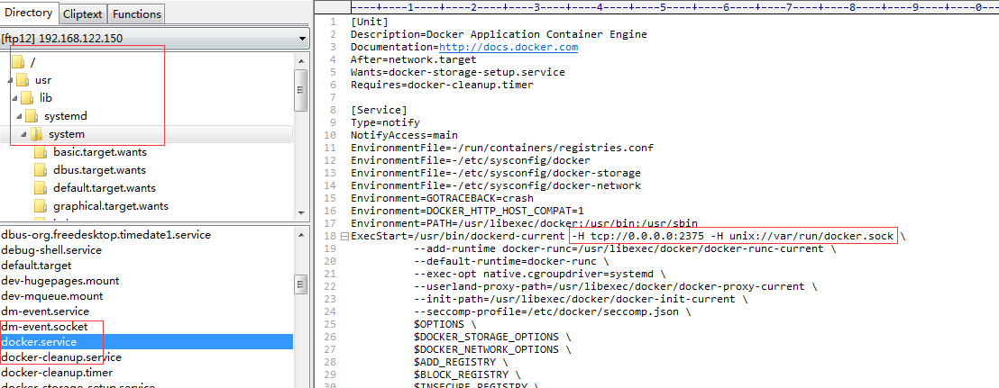
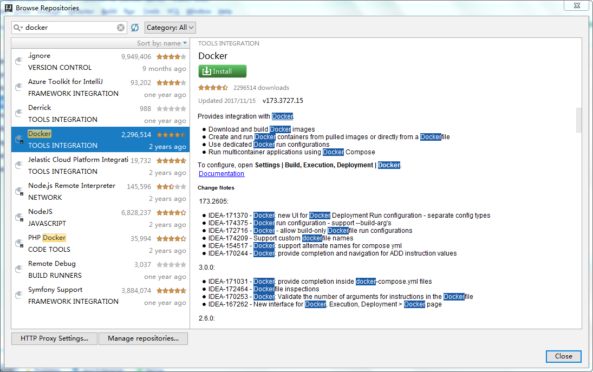
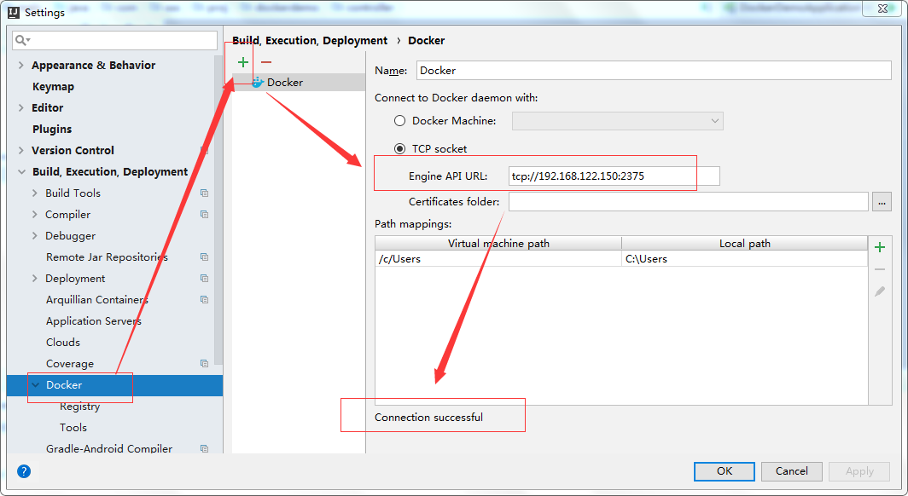
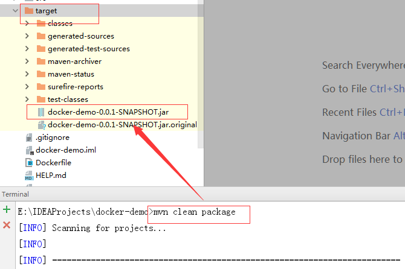
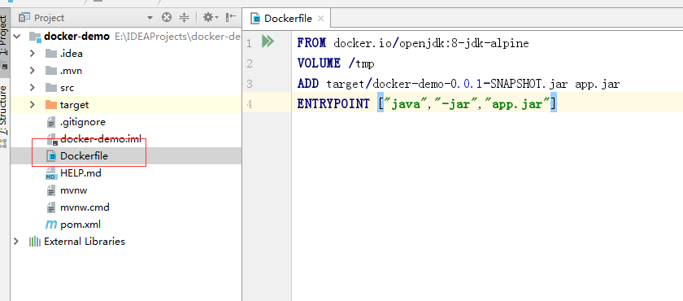
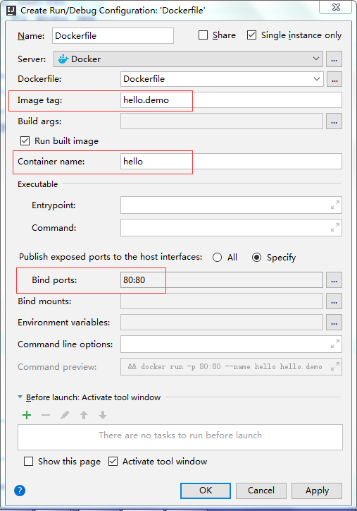
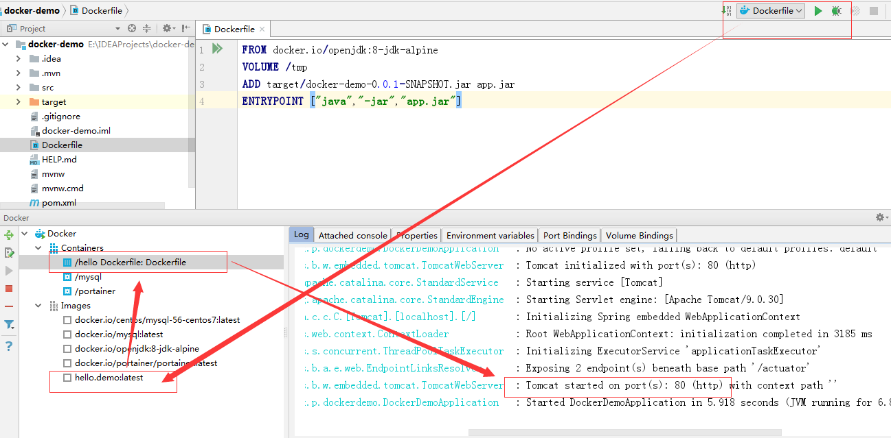
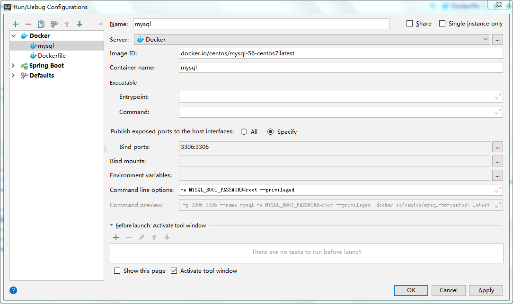
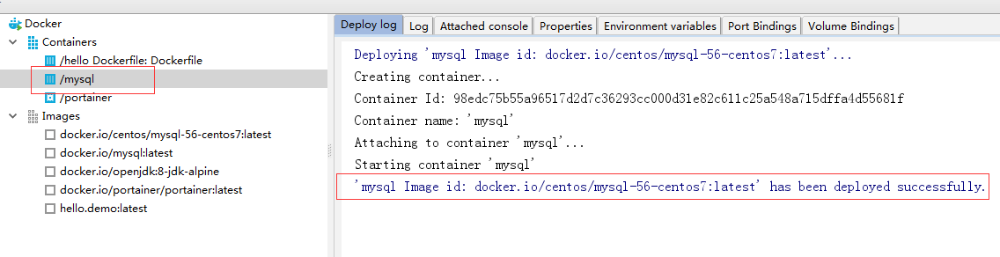

# 项目发布

## 服务端

### Docker开启远程端口

```
修改 /usr/lib/systemd/system/docker.service 
在 ExecStart=/usr/bin/dockerd-current 后追加
-H tcp://0.0.0.0:2375 -H unix://var/run/docker.sock \
```



### 重新加载配置

```sh
[root@container ~]# systemctl daemon-reload
[root@container ~]# systemctl restart docker
[root@container ~]# 
```

### 拉取opensdk镜像

```sh
[root@container ~]# docker load<openjdk8-jdk-alpine.tar 
503e53e365f3: Loading layer 5.793 MB/5.793 MB
744b4cd8cf79: Loading layer 3.584 kB/3.584 kB
4c6899b75fdb: Loading layer 100.3 MB/100.3 MB
Loaded image: docker.io/openjdk:8-jdk-alpine
[root@container ~]# docker images
REPOSITORY              TAG                 IMAGE ID            CREATED             SIZE
docker.io/openjdk   8-jdk-alpine        792ff45a2a17        12 months ago       105 MB
```

## 客户端

### 安装docker插件



### idea连接docker



## 项目发布

### 打包



### 创建Dockerfile

创建 Dockerfile 文件，Dockerfile 文件用来说明如何来构建镜像。

```dockerfile
FROM docker.io/openjdk:8-jdk-alpine
VOLUME /tmp
ADD target/demo-0.0.1-SNAPSHOT.jar app.jar
ENTRYPOINT ["java","-jar","app.jar"]
```




### 配置部署规则



### 发布



### 效果

```sh
[root@container ~]# docker images
REPOSITORY          TAG                 IMAGE ID            CREATED             SIZE
hello.images        latest              361a4c3e9bba        44 seconds ago      126 MB
docker.io/openjdk   8-jdk-alpine        792ff45a2a17        12 months ago       105 MB
[root@container ~]# docker ps -l
CONTAINER ID IMAGE COMMAND CREATED    STATUS    PORTS        NAMES
2166f8c61e06  361a4c3e9bba   "java -jar app.jar"   54 seconds ago    Up 53 seconds       0.0.0.0:80->80/tcp   hello
[root@container ~]# 
```


## 附：发布mysql

```
镜像名称：docker.io/centos/mysql-56-centos7:latest
容器名称：mysql
端口映射：3306:3306
命令行参数： -e MYSQL_ROOT_PASSWORD=root --privileged
```



