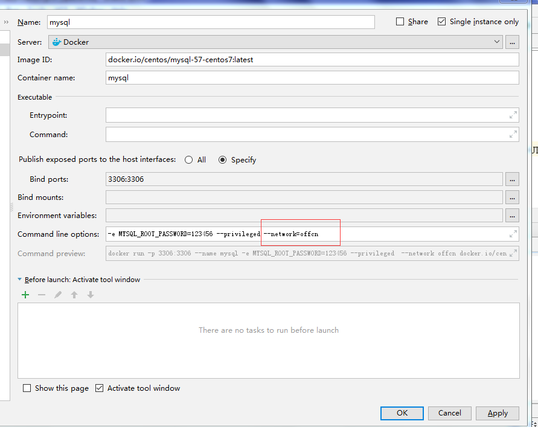
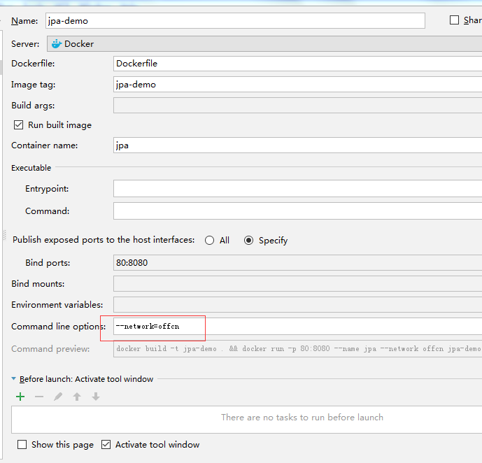
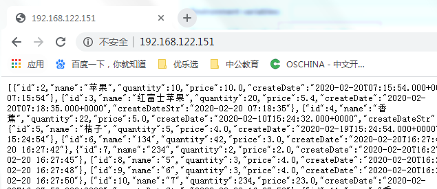

# docker网络

## 创建网络

```sh
[root@container ~]# docker network create offcn
5fa49771478b0c5a82a1b4299d2b73f46d21a010eaf757d0feaa30dca8eadadd
[root@container ~]# docker network ls
NETWORK ID          NAME                DRIVER              SCOPE
a4ed97579556        bridge              bridge              local
7e6fad93bfd2        hello_default       bridge              local
9903e6ea6647        host                host                local
37e4a86aecc3        javaweb_default     bridge              local
532d2b8be38c        none                null                local
5fa49771478b        offcn               bridge              local
[root@container ~]# 
```

## 发布数据库

容器名称为：mysql，网络：offcn

```
镜像名称：docker.io/centos/mysql-56-centos7:latest
容器名称：mysql
端口映射：3306:3306
命令行参数： -e MYSQL_ROOT_PASSWORD=123456 --privileged --network=offcn
```



## 发布微服务

### application.yml

使用容器名（mysql）访问数据库

```sh
spring:
  jpa:
    show-sql: true
    hibernate:
      ddl-auto: update
  datasource:
    url: jdbc:mysql://mysql:3306/youlexuandb?useUnicode=true&characterEncoding=utf-8&serverTimezone=UTC
    driver-class-name: com.mysql.jdbc.Driver
    username: root
    password: 123456

```

### 构建

```sh
#打包时忽略测试（因为使用容器名访问数据库，测试将失败）
E:\IDEAProjects\JpaDemo>mvn  package  -Dmaven.test.skip=true
```


### 创建Dockerfile

```dockerfile
FROM docker.io/openjdk:8-jdk-alpine
VOLUME /tmp
ADD target/jpa-demo-0.0.1-SNAPSHOT.jar app.jar
ENTRYPOINT ["java","-jar","app.jar"]
```


### 配置

```
容器名称：jpa
端口映射：80:8080
命令行参数： --network=offcn
```



## 效果

