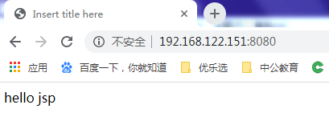
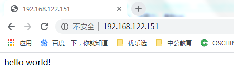

# docker-compose编排

## 简介

```
Docker-Compose项目是Docker官方的开源项目，负责实现对Docker容器集群的快速编排。

Docker-Compose将所管理的容器分为三层，分别是工程（project），服务（service）以及容器（container）。Docker-Compose运行目录下的所有文件（docker-compose.yml，extends文件或环境变量文件等）组成一个工程，若无特殊指定工程名即为当前目录名。一个工程当中可包含多个服务，每个服务中定义了容器运行的镜像，参数，依赖。一个服务当中可包括多个容器实例，Docker-Compose并没有解决负载均衡的问题，因此需要借助其它工具实现服务发现及负载均衡。

Docker-Compose的工程配置文件默认为docker-compose.yml，可通过环境变量COMPOSE_FILE或-f参数自定义配置文件，其定义了多个有依赖关系的服务及每个服务运行的容器。

使用一个Dockerfile模板文件，可以让用户很方便的定义一个单独的应用容器。在工作中，经常会碰到需要多个容器相互配合来完成某项任务的情况。例如要实现一个Web项目，除了Web服务容器本身，往往还需要再加上后端的数据库服务容器，甚至还包括负载均衡容器等。

Compose允许用户通过一个单独的docker-compose.yml模板文件（YAML 格式）来定义一组相关联的应用容器为一个项目（project）。

Docker-Compose项目由Python编写，调用Docker服务提供的API来对容器进行管理。因此，只要所操作的平台支持Docker API，就可以在其上利用Compose来进行编排管理。
```


## 前置条件

### 关闭firewalld.service

```sh
[root@container /]#systemctl stop firewalld.service
[root@container /]#systemctl disable firewalld.service
```

### 关闭SELinux

```sh
[root@container /]#vi /etc/sysconfig/selinux
```

 修改SELINUX=disabled并重启服务器

### 重启服务器

```sh
[root@container /]#shutdown now  halt
```

### 重启Docker

```sh
[root@container ~]# systemctl start docker
```


## 安装docker-compose

### 下载

从国内镜像下载http://get.daocloud.io/#install-compose

```sh
[root@container /]#curl -L https://get.daocloud.io/docker/compose/releases/download/1.25.4/docker-compose-`uname -s`-`uname -m` > /usr/local/bin/docker-compose
  % Total    % Received % Xferd  Average Speed   Time    Time     Time  Current
                                 Dload  Upload   Total   Spent    Left  Speed
100   423  100   423    0     0    251      0  0:00:01  0:00:01 --:--:--   251
100 16.3M  100 16.3M    0     0  2656k      0  0:00:06  0:00:06 --:--:-- 3652k
[root@container ~]# 

```

### 修改权限

```sh
#增加执行权限
[root@container /]# chmod +x /usr/local/bin/docker-compose
```

### 检查版本

```sh
[root@container ~]# docker-compose --version
docker-compose version 1.25.4, build 8d51620a
```


## 创建镜像并发布

### 创建工作目录

```sh
[root@container ~]# mkdir -p /usr/local/javaweb
```

### 上传文件

```sh
[root@container ~]# cd /usr/local/javaweb
[root@container javaweb]# ll
总用量 190368
-rw-r--r-- 1 root root   9393241 7月  10 2019 apache-tomcat-8.5.15.tar.gz
-rw-r--r-- 1 root root 185540433 7月  10 2019 jdk-8u131-linux-x64.tar.gz 
```

### 创建Dockerfile

```dockerfile
[root@container javaweb]# vi Dockerfile
#设置镜像
FROM docker.io/centos:7
#解压jdk
ADD jdk-8u131-linux-x64.tar.gz /usr/local
#设置环境变量JAVA_HOME
ENV JAVA_HOME /usr/local/jdk1.8.0_131
#解压tomcat
ADD apache-tomcat-8.5.15.tar.gz /usr/local
#释放8080端口
EXPOSE 8080
#启动tomcat
ENTRYPOINT ["/usr/local/apache-tomcat-8.5.15/bin/catalina.sh", "run"]
```

### 定义Compose文件

```yaml
[root@container javaweb]# vi docker-compose.yml
version: "3"        #指定语法的版本
services:          #定义服务
  tomcat1:        #服务的名称，-p参数后接服务名称
    container_name: TomcatServer    #容器的名称
    hostname: tomcat1            #主机名称
    build: .                      #指定Dockerfile所在目录
    ports:                      #指定端口映射
      - 8080:8080
    volumes:                  #物理机与容器的磁盘映射关系
      - ./webroot:/usr/local/apache-tomcat-8.5.15/webapps/ROOT

```

### 创建web发布目录

```sh
[root@container javaweb]# mkdir /usr/local/javaweb/webroot
```

### 添加index.jsp

```sh
[root@container javaweb]# cd /usr/local/javaweb/webroot
[root@container webroot]# vi index.jsp
<%@ page language="java" contentType="text/html; charset=UTF-8"
    pageEncoding="UTF-8"%>
<!DOCTYPE html PUBLIC "-//W3C//DTD HTML 4.01 Transitional//EN" "http://www.w3.org/TR/html4/loose.dtd">
<html>
<head>
<meta http-equiv="Content-Type" content="text/html; charset=UTF-8">
<title>Insert title here</title>
</head>
<body>
hello jsp
</body>
</html>
```

### 文件目录结构

```sh
[root@container webroot]# cd /usr/local/javaweb
[root@container javaweb]# pwd
/usr/local/javaweb
[root@container javaweb]# find
.
./webroot
./webroot/index.jsp
./jdk-8u131-linux-x64.tar.gz
./apache-tomcat-8.5.15.tar.gz
./Dockerfile
./docker-compose.yml
```

### 构建并运行compose

运行docker-compose up 命令构建 -d 表示在后台运行   # --build 构建镜像

```sh
[root@container javaweb]# docker-compose up -d --build
Creating network "javaweb_default" with the default driver
Building tomcat1
Step 1/6 : FROM centos:7
 ---> 5e35e350aded
Step 2/6 : ADD jdk-8u131-linux-x64.tar.gz /usr/local
 ---> 594793634061
Removing intermediate container 4b80d32ea3f4
Step 3/6 : ENV JAVA_HOME /usr/local/jdk1.8.0_131
 ---> Running in a94e8e2c1ffc
 ---> ace7211bcf5c
Removing intermediate container a94e8e2c1ffc
Step 4/6 : ADD apache-tomcat-8.5.15.tar.gz /usr/local
 ---> a0b1a3e4b565
Removing intermediate container 932b8dc193d4
Step 5/6 : EXPOSE 8080
 ---> Running in c7b570817f69
 ---> df0c2330a2ec
Removing intermediate container c7b570817f69
Step 6/6 : ENTRYPOINT /usr/local/apache-tomcat-8.5.15/bin/catalina.sh run
 ---> Running in e2ebc173b1b9
 ---> 25611f541f12
Removing intermediate container e2ebc173b1b9
Successfully built 25611f541f12
Creating TomcatServer ... done
```

### 检查docker镜像和容器

```sh
[root@container javaweb]# docker images
REPOSITORY          TAG                 IMAGE ID            CREATED             SIZE
javaweb_tomcat1     latest              324a75351626        2 minutes ago       592 MB
docker.io/centos    7                   5e35e350aded        3 months ago        203 MB
[root@container javaweb]# docker ps 
CONTAINER ID  IMAGE  COMMAND  CREATED    STATUS    PORTS    NAMES
db60778b4740        javaweb_tomcat1     "/usr/local/apache..."   2 minutes ago       Up 2 minutes        0.0.0.0:8080->8080/tcp   TomcatServer
[root@container javaweb]# 
```

### 访问容器

```http
访问： http://192.168.122.151:8080/
```



## 从镜像发布

### 重新定义Compose文件

```yaml
[root@container javaweb]# cp docker-compose.yml docker-compose.yml1
[root@container javaweb]# vi docker-compose.yml
version: "3"
services:
  tomcat1:
    container_name: TomcatServer
    hostname: tomcat1
    image: 'docker.io/tomcat:8.5-jre8'         #镜像名称
    ports:
      - 8080:8080
    volumes:
      - ./webroot:/usr/local/tomcat/webapps/ROOT

```

对比之前的文件

```yaml
[root@container javaweb]# cat docker-compose.yml1
version: "3"        #指定语法的版本
services:          #定义服务
  tomcat1:        #服务的名称，-p参数后接服务名称
    container_name: TomcatServer    #容器的名称
    hostname: tomcat1            #主机名称
    build: .                      #指定Dockerfile所在目录
    ports:                      #指定端口映射
      - 8081:8080
    volumes:                  #物理机与容器的磁盘映射关系
      - ./webroot:/usr/local/apache-tomcat-8.5.15/webapps/ROOT

```

### 构建

```sh
[root@container javaweb]# docker-compose up -d 
Pulling tomcat1 (tomcat:8.5-jre8)...
Trying to pull repository docker.io/library/tomcat ... 
8.5-jre8: Pulling from docker.io/library/tomcat
c5e155d5a1d1: Pull complete
221d80d00ae9: Pull complete
4250b3117dca: Pull complete
d1370422ab93: Pull complete
deb6b03222ca: Pull complete
9cdea8d70cc3: Pull complete
968505be14db: Pull complete
04b5c270ac81: Pull complete
301d76fcab1f: Pull complete
57ca7a0b9e79: Pull complete
3c1d6826d7a3: Pull complete
Digest: sha256:7cdf9dca1472da80e7384403c57b0632753a3a5cdf4f310fc39462e08af8ef39
Status: Downloaded newer image for docker.io/tomcat:8.5-jre8
Recreating TomcatServer ... done
```

## 发布微服务

### 上传hello

```sh
[root@container hello]# ll
总用量 52
-rw-r--r-- 1 root root   120 2月  27 10:02 Dockerfile
-rw-r--r-- 1 root root  9705 2月  27 09:38 hello.iml
-rw-r--r-- 1 root root  1129 2月  27 09:37 HELP.md
-rw-r--r-- 1 root root 10070 2月  27 09:37 mvnw
-rw-r--r-- 1 root root  6608 2月  27 09:37 mvnw.cmd
-rw-r--r-- 1 root root  2337 2月  27 11:39 pom.xml
-rw-r--r-- 1 root root   985 2月  27 11:31 README.en.md
-rw-r--r-- 1 root root  1356 2月  27 11:31 README.md
drwxr-xr-x 4 root root    30 2月  27 23:50 src
drwxr-xr-x 9 root root   213 2月  27 23:50 target
[root@container hello]# 
```

### 查看dockerfile

```sh
[root@container hello]# cat Dockerfile 
FROM docker.io/openjdk:8-jdk-alpine
VOLUME /tmp
ADD target/hello-1.0.jar app.jar
ENTRYPOINT ["java","-jar","app.jar"]
[root@container hello]# 
```

### 定义Compose文件

```sh
[root@container hello]#  vi docker-compose.yml
version: '3'
services:
  hello: 
    container_name: hello    #容器的名称
    hostname: hello
    build: .                    #指定Dockerfile所在目录
    ports:                      #指定端口映射
      - 80:80

```

### 构建并运行

```sh
[root@container hello]#  docker-compose up -d --build 
Creating network "hello_default" with the default driver
Building hello
Step 1/4 : FROM docker.io/openjdk:8-jdk-alpine
 ---> 792ff45a2a17
Step 2/4 : VOLUME /tmp
 ---> Running in d383e4d8f9fa
 ---> ef4bc5e87c27
Removing intermediate container d383e4d8f9fa
Step 3/4 : ADD target/hello-1.0.jar app.jar
 ---> 5dc9118eef78
Removing intermediate container b54b77361be1
Step 4/4 : ENTRYPOINT java -jar app.jar
 ---> Running in 0c2d40886671
 ---> b6e346eca046
Removing intermediate container 0c2d40886671
Successfully built b6e346eca046
Creating hello ... done
```

### 检查镜像和容器

```sh
[root@container hello]# docker images
REPOSITORY          TAG                 IMAGE ID            CREATED              SIZE
hello_hello         latest              410affb209cc        About a minute ago   126 MB
javaweb_tomcat1     latest              324a75351626        44 minutes ago       592 MB
docker.io/centos    7                   5e35e350aded        3 months ago         203 MB
docker.io/tomcat    8.5-jre8            3639174793ba        9 months ago         463 MB
docker.io/openjdk   8-jdk-alpine        792ff45a2a17        12 months ago        105 MB
[root@container hello]# docker ps
CONTAINER ID        IMAGE               COMMAND               CREATED              STATUS              PORTS                    NAMES
5d7412376132        hello_hello         "java -jar app.jar"   About a minute ago   Up About a minute   0.0.0.0:80->80/tcp       hello
be4b723f3b7a        tomcat:8.5-jre8     "catalina.sh run"     23 minutes ago       Up 23 minutes       0.0.0.0:8080->8080/tcp   TomcatServer
[root@container hello]# 
```


### 访问容器

