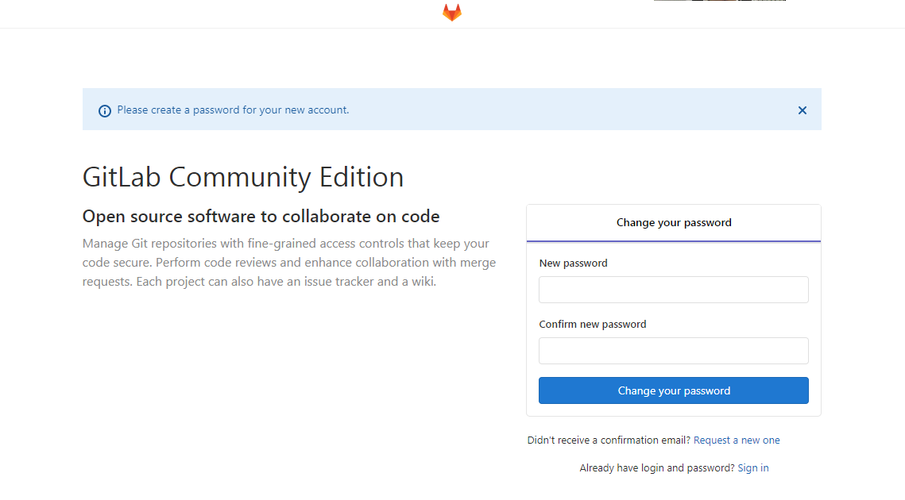

# docker搭建gitlab

## 部署（注意：至少保证虚拟机有4G内存）

### 创建目录

```sh
[root@localhost ~]# mkdir /data
[root@localhost ~]# mkdir /data/gitlab
[root@localhost ~]# mkdir /data/gitlab/config
[root@localhost ~]# mkdir /data/gitlab/logs
[root@localhost ~]# mkdir /data/gitlab/data
[root@localhost ~]# 
```


### 创建容器

```sh
设置环境变量
[root@localhost data]# GITLAB_HOME=/data/gitlab
添加容器
[root@localhost data]#  docker run -d --hostname gitlab -p 8443:443 -p 8000:80 -p 2222:22 --name gitlab --restart always -v $GITLAB_HOME/config:/etc/gitlab --volume $GITLAB_HOME/logs:/var/log/gitlab --volume $GITLAB_HOME/data:/var/opt/gitlab --privileged docker.io/gitlab/gitlab-ce:latest
```

### 登陆容器

```sh
[root@localhost data]# docker exec -ti -u root gitlab /bin/sh
```

### 修改端口

```sh
# vi /etc/gitlab/gitlab.rb
#773行
unicorn['port'] = 8000
```

### 重启配置

```sh
root@gitlab:/usr/sbin# dpkg-reconfigure 
debconf: unable to initialize frontend: Dialog
debconf: (No usable dialog-like program is installed, so the dialog based frontend cannot be used. at /usr/share/perl5/Debconf/FrontEnd/Dialog.pm line 76.)
debconf: falling back to frontend: Readline
debconf: unable to initialize frontend: Readline
debconf: (Can't locate Term/ReadLine.pm in @INC (you may need to install the Term::ReadLine module) (@INC contains: /etc/perl /usr/local/lib/x86_64-linux-gnu/perl/5.22.1 /usr/local/share/perl/5.22.1 /usr/lib/x86_64-linux-gnu/perl5/5.22 /usr/share/perl5 /usr/lib/x86_64-linux-gnu/perl/5.22 /usr/share/perl/5.22 /usr/local/lib/site_perl /usr/lib/x86_64-linux-gnu/perl-base .) at /usr/share/perl5/Debconf/FrontEnd/Readline.pm line 7.)
debconf: falling back to frontend: Teletype
/usr/sbin/dpkg-reconfigure: please specify a package to reconfigure
root@gitlab:/usr/sbin# exit
[root@localhost data]#docker stop gitlab
[root@localhost data]#docker start gitlab
```

## 应用

### 登陆并设置root密码

```http
要等很久
http://192.168.122.150:8000/
```

## 首次登录

首次登录要求修改root用户的密码，



## 拉取项目

```http
注意：访问端口为8000，http://IP:端口/用户/项目名.git
http://192.168.122.114:8000/platov/test.git
```

